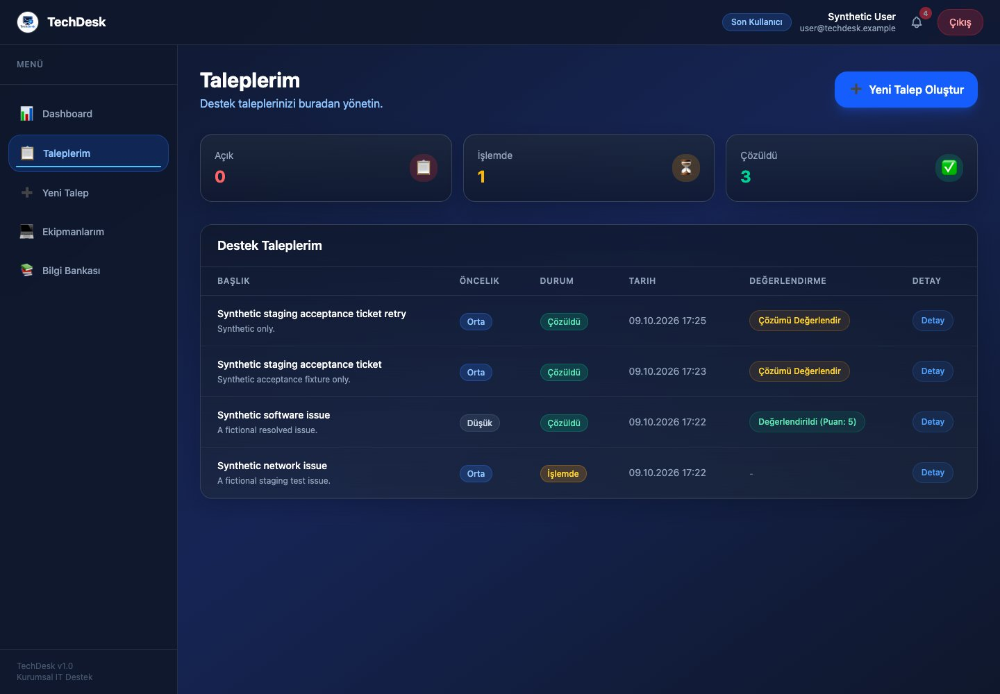
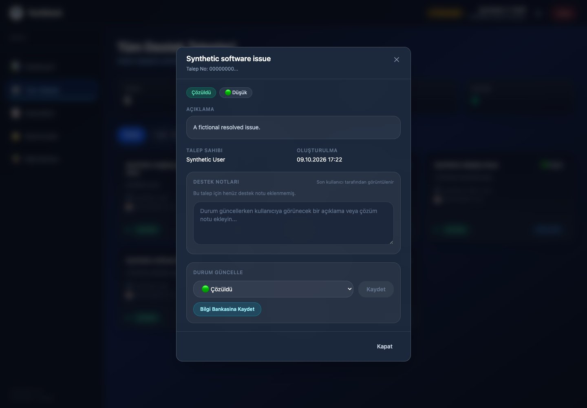
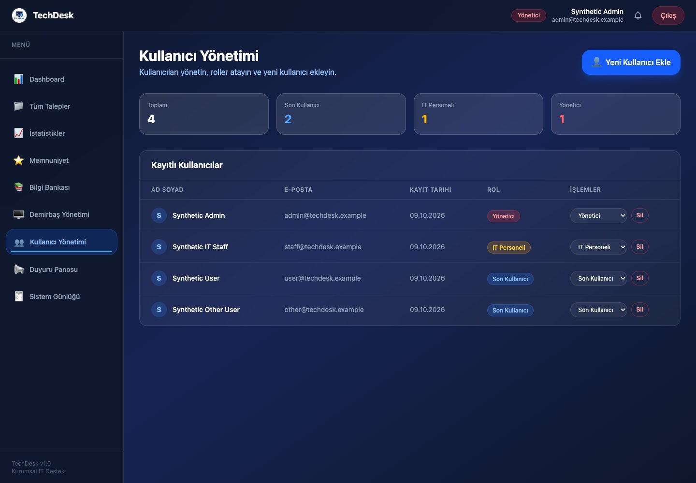
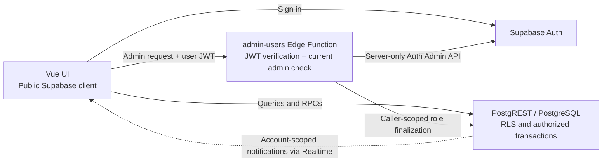

# TechDesk

**A role-based IT help desk built with Vue and Supabase.**

TechDesk brings employee support requests, IT resolution work, and device ownership into one workflow for end users, IT staff, and administrators.

It began as a final project for a university Information Systems Application Development course. Deliberate engineering stabilization added a versioned backend, database-enforced authorization, safer account handling, and reproducible tests. Acceptance used real Supabase services in disposable hosted staging with synthetic data only.

**Stack:** Vue 3 · JavaScript · Vite · Pinia · Vue Router · Tailwind CSS · Supabase Auth / PostgreSQL / Realtime / Edge Functions



*End-user view: personal tickets, priorities, status, and resolution feedback. The UI is currently in Turkish; all screenshot data is synthetic.*

## Workflows

| Role | Main workflow |
| --- | --- |
| End user | Open a ticket, optionally link assigned equipment, follow support notes and status, view assigned devices, and rate a resolved ticket. |
| IT staff | Filter the team queue, inspect equipment history, record support notes and status changes, and turn resolved cases into knowledge-base articles. |
| Administrator | Create/delete accounts through a server boundary, persist role changes, manage equipment assignments and announcements, and inspect audit logs. |

Shared articles and account-scoped notifications support these workflows. Dashboards summarize tickets and satisfaction; administrators can export reports to Excel.

<details>
<summary>See the IT and administrator views</summary>



*IT staff: case details, user-visible support notes, status controls, and the option to reuse a resolved case as a knowledge-base article.*



*Administrator: account and role management. Privileged create/delete operations run in the Edge Function, while role changes use an authorized database RPC.*

[Screenshot provenance](docs/screenshots/README.md)

</details>

## Engineering decisions



- **Database-enforced authorization.** All nine public tables have RLS. Current profile roles and live Auth sessions authorize requests; editable metadata and cached JWT roles do not. Persisted demotion takes effect without token refresh.
- **Server-side account management.** `admin-users` checks identity and current admin authority before using the Auth Admin API. Accounts bootstrap as ordinary users before role finalization. Self/admin deletion and last-admin protections hold; compensation failures are explicit. No service-role credentials reach the browser.
- **Transactional writes.** Ticket creation uses caller-scoped request UUIDs for idempotency. Status transitions reject stale versions and commit the ticket, note, asset state, notification, and audit record together.
- **Account state isolation.** Logout/switching clear account data, stop notification subscriptions/polling, invalidate stale async responses, and remount account views. Failed profile reads remove client authority.
- **Versioned backend contract.** The [migration](supabase/migrations/20261009125539_stabilization_baseline.sql), [synthetic seed](supabase/seed.sql), and [Edge Function](supabase/functions/admin-users/) accompany the frontend. This reference schema was derived from repository behavior, not a live database.

## Validation and boundaries

The [stabilization review](docs/STABILIZATION_REVIEW.md) records the acceptance matrix and limitations:

| Layer | Evidence |
| --- | --- |
| Automated | 73 tests across 7 files: SQL policies/transactions, client state races, configuration, transport, exports, and the Edge handler. Includes the portfolio capture's sign-in regression; database tests use PGlite with test-only Auth shims. |
| Hosted staging | Real Auth sign-in, PostgREST/RLS denial checks, ticket RPCs, persisted demotion, and admin create/finalize/delete passed. A notification INSERT was observed through Realtime; browser account-switching checks passed. |
| Build checks | Edge type-check, production-mode build, bundle isolation scan, and diff whitespace checks passed for the stabilization candidate. |

Production readiness and a public live deployment are not claimed. Live Supabase compatibility/migration remain deliberately untested, as do containerized local acceptance and separate two-browser Realtime delivery. The review also documents cross-service reconciliation limits and the staging Free plan's leaked-password-protection limitation.

## Run and inspect

Use Node 22.12+, 24, or 26. The automated suite runs without a container engine:

```sh
npm ci
npm test
npm run check:edge
```

For the full app, follow the [local backend guide](docs/LOCAL_BACKEND.md): it covers a fresh isolated Supabase instance, migration/reset, synthetic fixtures, public-only frontend configuration, and serving `admin-users`. That local workflow requires Docker or compatible Podman. Then run `npm run dev`.

Use the reference backend only in an isolated environment. Review live schema/data compatibility separately before any production migration.
